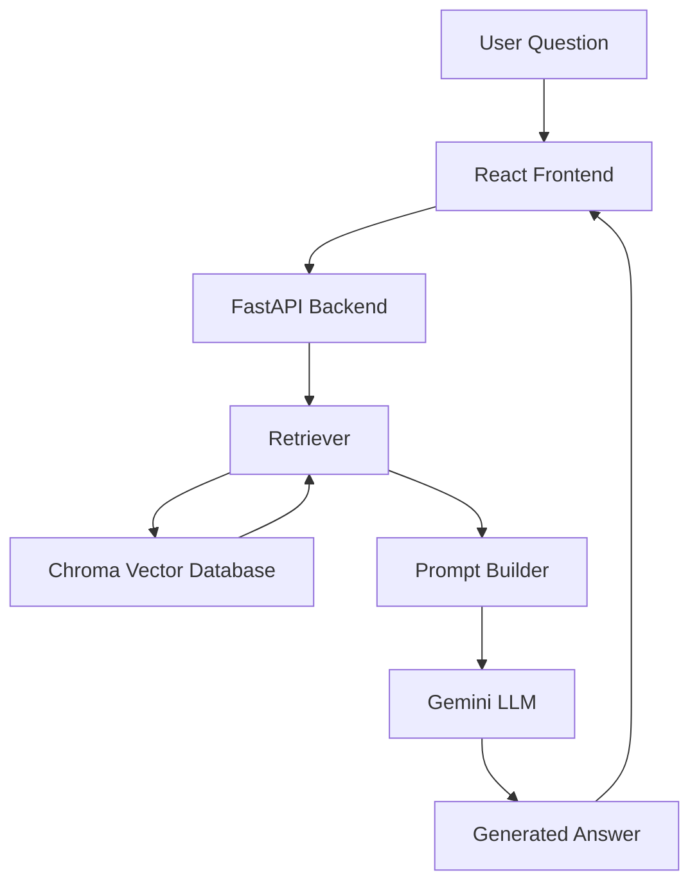
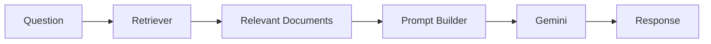

<div align="center">

# 🍥 RasgullaAI

### Your Portfolio Shouldn't Be Read.
### It Should Be Interviewed.


<p align="center">
  
</p>

<p align="center">


</p>

---

### 🚀 Live Demo

[🌐 Visit RasgullaAI](YOUR_FRONTEND_URL)

### 🔥 Backend API

[⚡ API Docs](YOUR_BACKEND_URL/docs)

</div>

---

# 🧠 What is RasgullaAI?

RasgullaAI is an AI-powered portfolio assistant that allows visitors to learn about me through natural conversation.

Instead of navigating multiple pages, users can simply ask questions such as:

```text
Who are you?

What projects have you built?

What technologies do you work with?

Tell me about your AI experience.

What are your future goals?
```

The system retrieves relevant information from a personal knowledge base and uses Retrieval-Augmented Generation (RAG) to generate accurate, context-aware responses.

---

# ✨ Why RasgullaAI?

Traditional portfolios force users to search for information.

RasgullaAI reverses the process.

The AI searches for the information and delivers it instantly.

Think of it as:

```text
Portfolio + RAG + LLM + Personality
```

or

```text
ChatGPT trained specifically on me.
```

---

# 🏗️ System Architecture



---

# ⚙️ Tech Stack

## Frontend

- React
- Vite
- JavaScript
- Modern Responsive UI

## Backend

- FastAPI
- Python
- REST API Architecture

## Artificial Intelligence

- Google Gemini
- Retrieval-Augmented Generation (RAG)
- Prompt Engineering

## Vector Database

- ChromaDB
- Semantic Search
- Embedding Retrieval

---

# 🧩 Project Structure

```bash
RasgullaAI
│
├── backend
│   ├── app
│   ├── data
│   ├── rag
│   ├── routes
│   ├── services
│   ├── chroma_storage
│   ├── main.py
│   └── requirements.txt
│
├── frontend
│   ├── public
│   ├── src
│   ├── package.json
│   └── vite.config.js
│
└── README.md
```

---

# 🔍 How Retrieval Works

```text
1. User asks a question
          ↓
2. Query converted into embeddings
          ↓
3. ChromaDB finds relevant context
          ↓
4. Retrieved knowledge sent to Gemini
          ↓
5. Gemini generates grounded response
          ↓
6. Answer returned to user
```

---

# 🧠 AI Pipeline



---

# 📂 Knowledge Base

The AI is trained on curated information including:

- Personal background
- Skills
- Projects
- Experience
- Achievements
- Technical interests
- Career goals

This ensures responses remain relevant and personalized.

---

# 🎯 Features

## 🤖 Conversational Portfolio

Ask questions naturally.

---

## 🔍 Semantic Search

Finds information by meaning rather than keywords.

---

## 🧠 Context-Aware Responses

Powered by Retrieval-Augmented Generation.

---

## ⚡ Fast API Backend

Optimized for low-latency responses.

---

## 💾 Persistent Vector Storage

Knowledge remains searchable through ChromaDB.

---

## 📱 Responsive Frontend

Works across desktop and mobile devices.

---

# 🚀 Local Setup

## Clone Repository

```bash
git clone https://github.com/CITIZEN-OF-INDIA/RasgullaAI.git
```

## Backend

```bash
cd backend

python -m venv venv

venv\Scripts\activate

pip install -r requirements.txt

uvicorn main:app --reload
```

---

## Frontend

```bash
cd frontend

npm install

npm run dev
```

---

# 🔌 API Endpoint

## Chat

```http
POST /chat
```

Request

```json
{
  "message": "Tell me about yourself"
}
```

Response

```json
{
  "response": "Generated answer..."
}
```

---

# 🌟 Future Improvements

- Memory-enabled conversations
- Multi-modal support
- Voice interaction
- Streaming responses
- Analytics dashboard
- Fine-tuned personal model
- Agentic workflows

---

# 📊 Engineering Highlights

✅ RAG Architecture

✅ Vector Search

✅ Gemini Integration

✅ FastAPI Backend

✅ React Frontend

✅ ChromaDB Storage

✅ Prompt Engineering

✅ Semantic Retrieval

---

# 👨‍💻 About The Developer

Hi, I'm **Ritvik Arora**.

I enjoy building systems that combine:

- Artificial Intelligence
- Backend Engineering
- Retrieval Systems
- Developer Tools
- Real-World Problem Solving

RasgullaAI represents my vision of how portfolios should evolve in the age of AI.

Not as documents.

But as intelligent systems.

---

<div align="center">

### ⭐ If you found this project interesting, consider giving it a star.

*"The best portfolio isn't the one that tells people who you are.*

*It's the one that can answer any question about you."*

</div>
